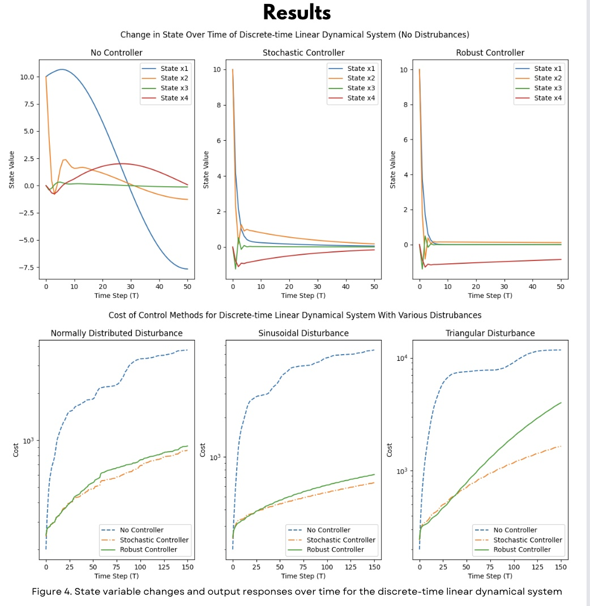

# Robust Control: Stabilizing Discrete-Time Linear Dynamical Systems Under Disturbances

## Overview

This project focuses on the design and evaluation of control strategies for **Discrete-Time Linear Dynamical Systems (LDS)**, particularly in the presence of disturbances. These disturbances can be stochastic (random and unpredictable) or adversarial (structured and potentially worst-case). We aim to compare the performance of **stochastic control** and **robust control** methods in stabilizing such systems while minimizing the associated costs.

The system studied in this project models the longitudinal flight control of a **Boeing 747**. The goal is to maintain stability and minimize control costs in a variety of disturbance scenarios, contributing to safer and more reliable control systems in complex, real-world applications.

---

## Features

- **Simulated Discrete-Time Linear Dynamical System (LDS)** with disturbances.
- **Control strategies**: Comparison between Stochastic Control and Robust Control.
- **Disturbance types**: Random (stochastic), structured, and adversarial.
- **Performance evaluation**: State trajectories, control effort, and cost metrics visualized and analyzed.
- **Applications**: Autonomous systems, robotics, aerospace, finance, and other domains requiring robust control under uncertainty.

---

## Methodology

1. **System Model**: 
   - We model the LDS using a set of state-space equations:
   ```math
   x(t+1) = A x(t) + B u(t) + D w(t)
   y(t) = C x(t)  
- Where A, B, C, and D are system matrices, x(t) is the state, u(t) is the control input, and w(t) is the disturbance input.

2. **Controllers**:
  - Stochastic Control: Designed to handle random disturbances, minimizing the expected cost.
  - Robust Control: Focused on minimizing the worst-case cost, providing guaranteed performance even under adversarial disturbances.

3. **Simulations**:
  - Multiple disturbance scenarios are simulated to compare the performance of stochastic and robust controllers.
  - The Linear Quadratic Regulator (LQR) approach is used to design the controllers.

4. **Evaluation**:
We evaluate the system performance through state trajectories, control inputs, and cost metrics across various disturbance types, including normally distributed, triangular, and structured disturbances.



## Conclusion
- Without controllers: The system shows significant overshoot, oscillation, and slow stabilization.
- Stochastic control: Quickly stabilizes the system with minimal overshoot and is more efficient in terms of cost across random disturbances.
- Robust control: Provides stronger stability guarantees in the presence of adversarial disturbances but may incur slightly higher costs than stochastic control.
